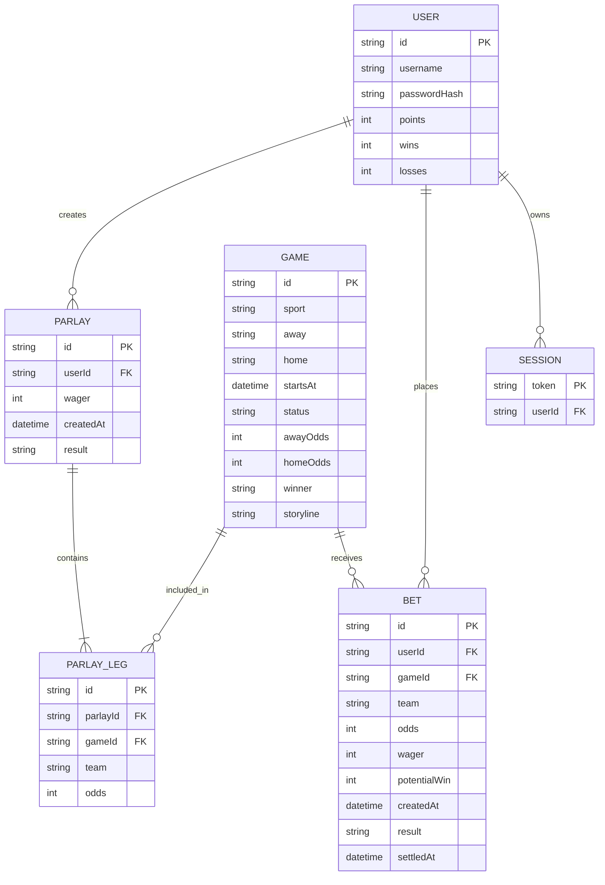

# HotShot ERD

## Relationship Summary

- One user can have many login sessions.
- One user can place many single-game bets.
- One user can create many parlays.
- One game can have many single-game bets.
- One parlay contains two or more parlay legs.
- Each parlay leg points to one game and one selected team.

## Notes

The current backend stores users, sessions, games, bets, parlays, and leaderboard totals in PostgreSQL. The ERD summarizes the relationships used by the backend API.
